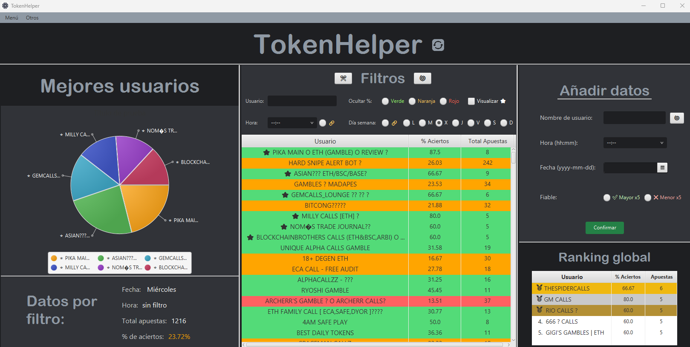
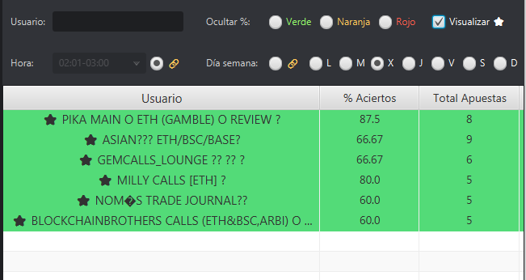
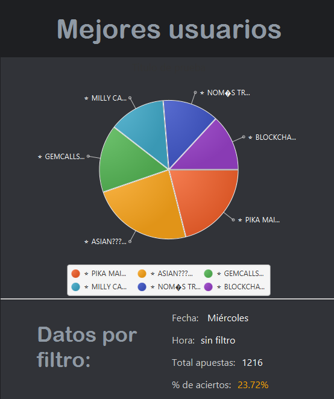
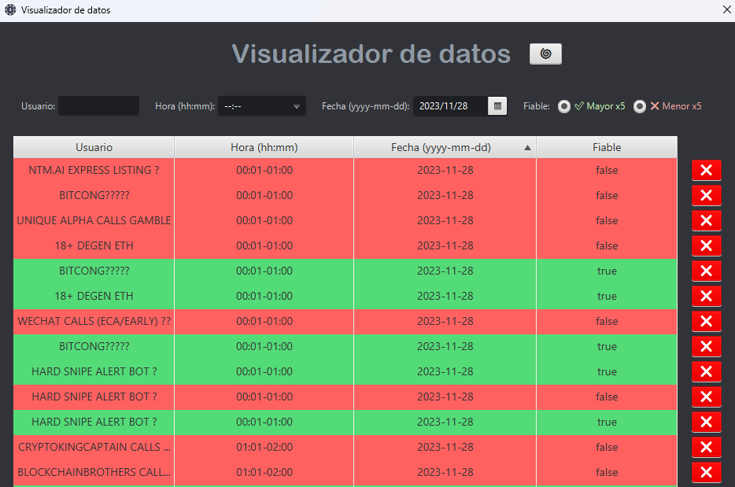

# TokenHelper

GUI to anticipate reliable tokens from users-bets.

The main idea is to store your data from your journal token activity and suggest which token to bet on.

- Like a "mega-app-note" to your bets with charts support.

## Deploy

There is an executable in `build/jpackage/TokenHelper/TokenHelper.exe`

- gradle 8.1: https://gradle.org/

## Interface

- javafx-sdk-17.0.8: https://openjfx.io/

### Home-Interface

We focus on leaving the most essential functionalities on the initial screen, due to you will want to have these tools to be the fastest gambler.

Check the users has a "⭐" they are the top in your filters:

In case you are doing some study about your user´s bets, you have the pie chart to give you support and keep always focusing to the best users from the filter you used.

### Data-Visualizer-Interface

This window allows you to delete your data and search for something special:

## Back-up

- It is implemented a back-up system to export your data from MongoDB using JSON to a branch on github "backup", but only works if you have access to edit that branch: https://github.com/Sbytmacke/TokenHelper/tree/backup

### MongoDB

To keep flexibility and easiest way to update data.

- You must have MongoDB installed in your local S.O.
