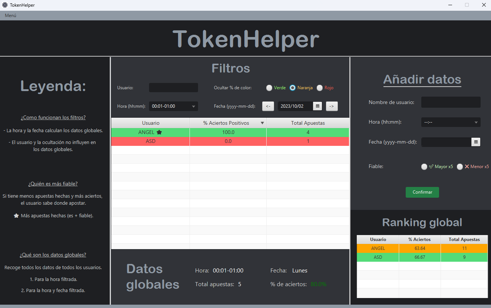

# TokenHelper

GUI to anticipate reliable tokens.

The main idea is to store your data from your journal token activity and suggest which token to bet on.

- Like a "mega-app-note" to your bets.

## MongoDB

To keep flexibility and easiest way to change data.

- You must have MongoDB installed in your local S.O.

## Dagger

Developing... not implemented...

## Java & Gradle

To have more compatibility with JavaFX.

## JavaFX

Simple interface where you can filter when yopu want to bet, and is going to suggest you. Or add new data.

### Init interface (developing)

